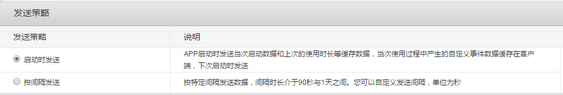

# 介绍 #
本Demo为友盟应用统计的示例项目

# 集成步骤 #
参考[集成文档](http://dev.umeng.com/analytics/android-doc/integration)

测试用APPKEY 58d3f8acf5ade464810014ca

## 1. 官网注册 ##
[http://www.umeng.com/](http://www.umeng.com/)

## 2. 创建应用 ##

## 3. 集成SDK ##

	allprojects {
	    repositories {
	        mavenCentral()     
	    }
	}

	dependencies {
	   compile 'com.umeng.analytics:analytics:latest.integration'
	}

## 4. 权限配置 ##
	<uses-permission android:name="android.permission.ACCESS_NETWORK_STATE"/>
	<uses-permission android:name="android.permission.ACCESS_WIFI_STATE" />
	<uses-permission android:name="android.permission.INTERNET"/>
	<uses-permission android:name="android.permission.READ_PHONE_STATE"/>

### Android 6.0权限适配 ###
    private void checkPermission() {
        int result = ActivityCompat.checkSelfPermission(this, Manifest.permission.READ_PHONE_STATE);
        if (result == PackageManager.PERMISSION_DENIED) {
            ActivityCompat.requestPermissions(this, new String[]{Manifest.permission.READ_PHONE_STATE}, 0);
        }
    }

    @Override
    public void onRequestPermissionsResult(int requestCode, @NonNull String[] permissions, @NonNull int[] grantResults) {
        if (grantResults[0] == PackageManager.PERMISSION_DENIED) {
            Toast.makeText(this, "权限被拒绝，无法统计", Toast.LENGTH_SHORT).show();
        }
    }

## 5. AppKey和Channel配置 ##
    <application
        android:allowBackup="true"
        android:icon="@mipmap/ic_launcher"
        android:label="@string/app_name"
        android:supportsRtl="true"
        android:theme="@style/AppTheme"
        android:name=".MyApplication">

        <meta-data android:value="58d3f8acf5ade464810014ca" android:name="UMENG_APPKEY"/>
        <meta-data android:value="Wandoujia" android:name="UMENG_CHANNEL"/>

    </application>

## 6. 发送策略配置 ##
应用统计分析后台->设置->发送策略

## 6. Session统计 ##
确保在所有的Activity中都调用 MobclickAgent.onResume() 和MobclickAgent.onPause()方法，这两个调用将不会阻塞应用程序的主线程，也不会影响应用程序的性能。非常重要：必须调用 MobclickAgent.onResume() 和MobclickAgent.onPause()方法，才能够保证获取正确的新增用户、活跃用户、启动次数、使用时长等基本数据。

	public class BaseActivity extends AppCompatActivity {
	
	    @Override
	    public void onResume() {
	        super.onResume();
	        MobclickAgent.onResume(this);
	    }
	
	    @Override
	    public void onPause() {
	        super.onPause();
	        MobclickAgent.onPause(this);
	    }
	}

## 7. 自定义计数事件 ##
使用计数事件需要在后台添加事件时选择“计数事件”。

    public void onClick(View view) {
        MobclickAgent.onEvent(this, "event_click");
    }

